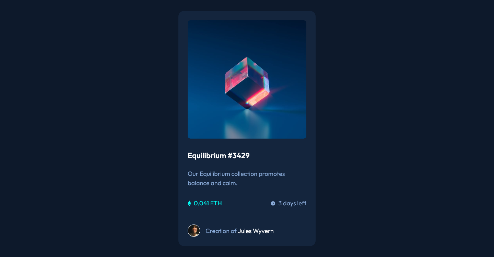

# Frontend Mentor - NFT Preview Card Component Solution

This is a solution to the NFT Preview Card Component challenge on Frontend Mentor. Frontend Mentor challenges help you improve your coding skills by building realistic projects.

## Table of contents

- [Overview](#overview)
  - [The challenge](#the-challenge)
  - [Screenshot](#screenshot)
  - [Links](#links)
- [My process](#my-process)
  - [Built with](#built-with)
  - [What I learned](#what-i-learned)
- [Author](#author)

## Overview

### The challenge

Users should be able to:

- View the optimal layout depending on their device's screen size
- See highly responsive hover states and animations for all interactive elements

### Screenshot



### Links

- [Solution](https://github.com/Kking927/nft-card-component)
- [Live Site](https://kking927.github.io/nft-card-component/)

## My process

### Built with

- Semantic HTML5 markup
- CSS Custom Properties
- Flexbox
- Mobile-first workflow
- CSS Transitions & Keyframe Animations

### What I learned

During this project, I focused on improving my architectural structure by using the **BEM** naming convention and gained more practice adding CSS Keyframe Animations.

```
@keyframes clockPulse {
  0% { transform: scale(1); }
  50% { transform: scale(1.35); }
  100% { transform: scale(1); }
}

.card__stat-item--time:hover .card__stat-icon {
  animation: clockPulse 1s infinite ease-in-out;
}
```

## Author

- Frontend Mentor - [@Kking927](https://www.frontendmentor.io/profile/Kking927)
